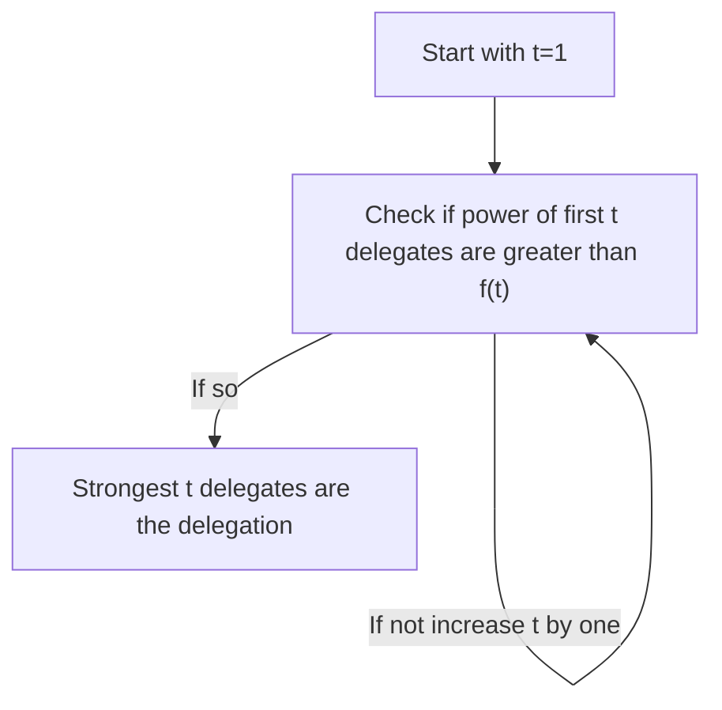

Threshold rules için bir threshold fonksiyonu tanımlıyoruz.

Threshold fonksiyonu bir seri ima ediyor.

1 ile 1/2 arasında bir sayı alıyoruz. Bu bizim $f(1)$'imiz.

Bu sayıya bir ekliyoruz, ikiye bölüyoruz. $f(2)$'yi seçerken bu bulduğumuz değerden yüksek bir değer seçiyoruz.

Böyle devam ediyor. Genel formül şöyle:

$f(t+1)>\frac{f(t)+1}{2}$

Threshold fonksiyonları da şöyle işliyor:

oy oranı en fazla adayı alıyoruz ve belirlediğimiz $f(1)$'i geçiyor mu ona bakıyoruz. Geçiyorsa delegeyi bulduk.

Geçmiyorsa, oy oranı en fazla ilk iki adayı alıyoruz, toplam oyları $f(2)$yi geçiyor mu ona bakıyoruz. Geçiyorsa delegeyi bulduk.

...ve böyle devam ediyoruz.